# Tutorial 2: Broadcast Chat

## Experiment 2.1: Original code, and how it run
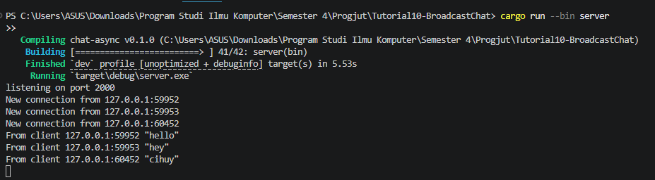
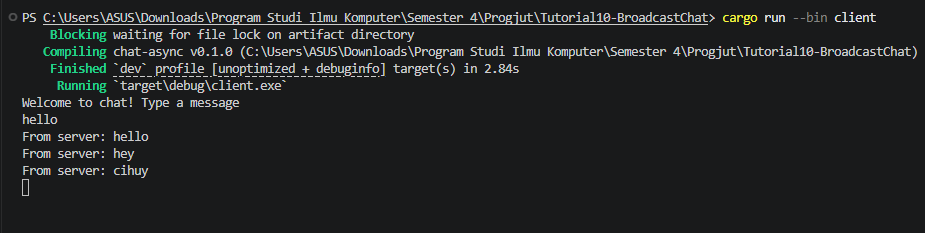
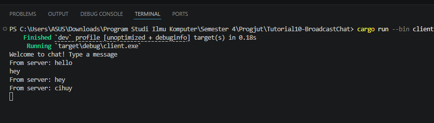
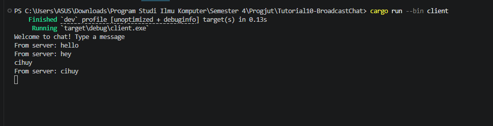

**Cara menjalankan program:**

1. Buka satu terminal, masuk ke direktori project, lalu jalankan server:
   ```bash
   cargo run --bin server

2. Buka tiga terminal baru secara terpisah, lalu jalankan client di masing-masing terminal tersebut:
   ```bash
   cargo run --bin client

3. Ketik pesan di salah satu terminal client dan tekan Enter. Pesan tersebut akan muncul di semua terminal client lainnya yang sedang terhubung ke server.

## Penjelasan

Pada tutorial ini, saya menjalankan satu buah server dan tiga buah client secara paralel di terminal yang terpisah. Saat saya menginput dan mengirimkan teks dari salah satu terminal client, pesan tersebut langsung diteruskan ke server. Setelah menerimanya, server seketika melakukan proses broadcast (siaran) dengan mendistribusikan pesan tersebut ke semua terminal client lain yang saat itu berstatus connected. Hasilnya, obrolan dari satu pengguna dapat dibaca oleh seluruh pengguna lainnya secara real-time.

Beberapa poin penting yang terjadi di belakang layar:

1. Konkurensi Tinggi: Server tidak bekerja secara sekuensial (menunggu satu client selesai baru melayani client lain), melainkan mampu memproses lalu lintas data dari banyak client secara bersamaan (concurrently) tanpa memblokir proses lainnya.

2. Protokol WebSocket: Penggunaan WebSockets (berbeda dengan HTTP biasa) menjaga koneksi ("pipa komunikasi") antara server dan tiap client tetap terbuka terus-menerus (persistent). Ini memungkinkan aliran data dua arah (mengirim dan menerima) yang sangat cepat kapan pun dibutuhkan.

3. Peran Async Runtime: Kehadiran runtime asinkron (seperti Tokio di Rust) adalah kunci utama yang membuat server tetap berjalan ringan dan sangat responsif, meskipun harus me-l-routing pesan ke berbagai soket koneksi di waktu yang hampir bersamaan.

## Experiment 2.2: Modifying the websocket port
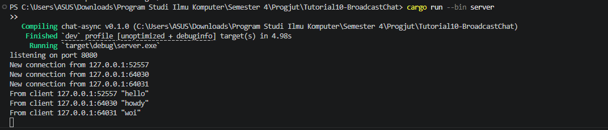
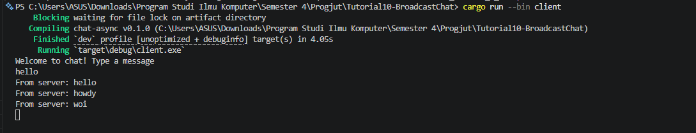
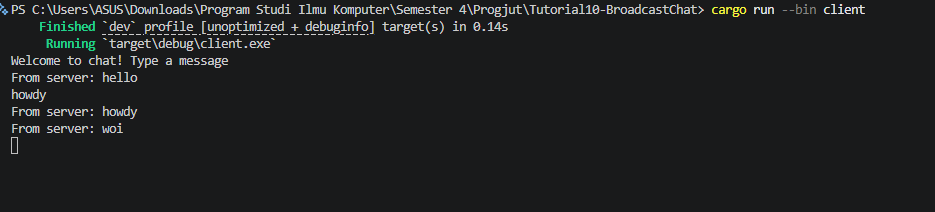
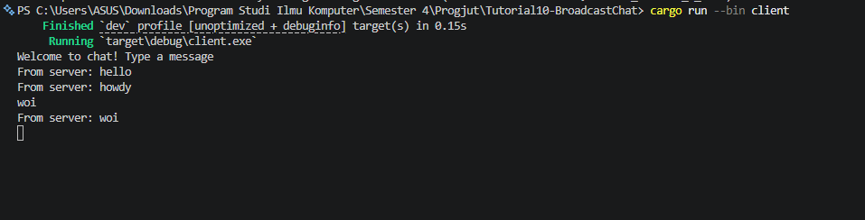
Pada eksperimen ini, saya ditugaskan untuk mengubah port komunikasi aplikasi dari yang semula menggunakan port 2000 menjadi 8080. Setelah saya melakukan modifikasi dan menjalankan ulang programnya, aplikasi chat tetap beroperasi dengan lancar. Proses pengiriman dan penerimaan pesan (broadcast) antar client via server berjalan normal tanpa ada kendala.

Untuk mewujudkan perubahan ini, modifikasi mutlak harus dilakukan pada dua buah file yang mewakili kedua sisi koneksi jaringan, yaitu:

1. Sisi Server (server.rs): Saya mengubah nilai string pada bagian TcpListener::bind menjadi "127.0.0.1:8080". Langkah ini bertujuan agar server menginstruksikan sistem operasi untuk membuka dan "mendengarkan" lalu lintas data masuk secara spesifik pada port 8080.

2. Sisi Client (client.rs): Saya memodifikasi target URI pada ClientBuilder::from_uri menjadi "ws://127.0.0.1:8080". Hal ini berfungsi untuk mengarahkan client agar mengetuk pintu koneksi pada port yang tepat saat ingin menghubungi server.

### Mengapa harus diubah di kedua sisi?

Hal ini dikarenakan sebuah koneksi jaringan memerlukan kesepakatan titik temu (endpoint) yang identik antara pihak penerima dan pengirim. Jika saya hanya mengubah port di server saja, maka client akan tersesat karena terus mencoba menghubungi port lama (2000) yang sudah tidak melayani koneksi (Connection Refused).

Selain itu, setelah meninjau kode yang ada, dapat dipastikan bahwa aplikasi ini tetap menggunakan protokol yang sama, yakni WebSocket. Definisi penggunaan protokol ini dapat dilihat secara jelas pada file client.rs, di mana alamat koneksinya diawali dengan scheme ws:// (menandakan koneksi WebSocket standar tanpa enkripsi TLS) pada parameter URI-nya.

## Experiment 2.3: Small changes, add IP and Port

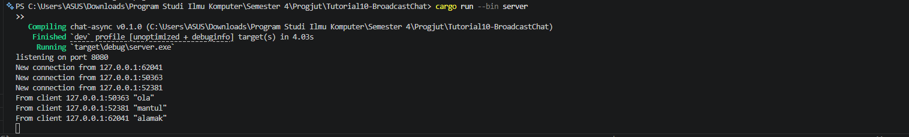
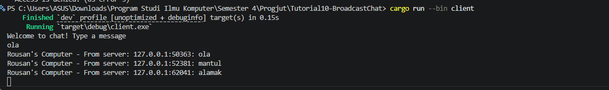
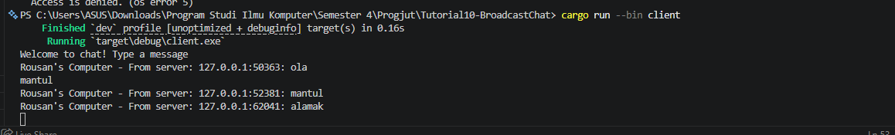
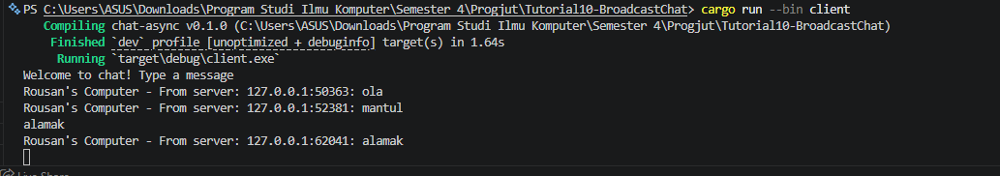

### Penjelasan Modifikasi:
Pada eksperimen ini, saya menambahkan informasi mengenai pengirim (berupa alamat IP dan nomor Port) ke dalam setiap pesan yang dikirimkan. Seperti yang terlihat pada gambar di atas, setiap pesan yang diterima oleh client kini memiliki format [IP]:[Port]: [Pesan].

#### Detail Perubahan:

Modifikasi ini dilakukan sepenuhnya pada sisi Server di file src/bin/server.rs. Perubahan spesifik berada di dalam loop penanganan koneksi (handle_connection), tepatnya pada bagian saat server menerima pesan teks dari ws_stream.next().await. Sebelum pesan tersebut diteruskan ke broadcast channel melalui tx.send(), saya melakukan pemformatan ulang string dengan menggabungkan variabel addr (informasi socket address pengirim) dengan isi pesan aslinya menggunakan makro format!.

#### Mengapa modifikasi dilakukan di sisi Server?

Ada dua alasan utama mengapa perubahan ini lebih logis dilakukan di server dibandingkan di client:

1. Akses Data: Server adalah pusat kendali yang secara otomatis memiliki informasi alamat socket (addr) dari setiap client yang terhubung. Client tidak mengetahui alamat IP client lain secara langsung.

2. Efisiensi: Dengan memformat pesan di server sebelum proses broadcast, server hanya perlu melakukan proses penggabungan string satu kali. Seluruh client yang terhubung akan langsung menerima pesan yang sudah "matang" beserta identitas pengirimnya. Ini jauh lebih efisien daripada membebankan setiap client untuk mengolah identitas pengirim secara terpisah.